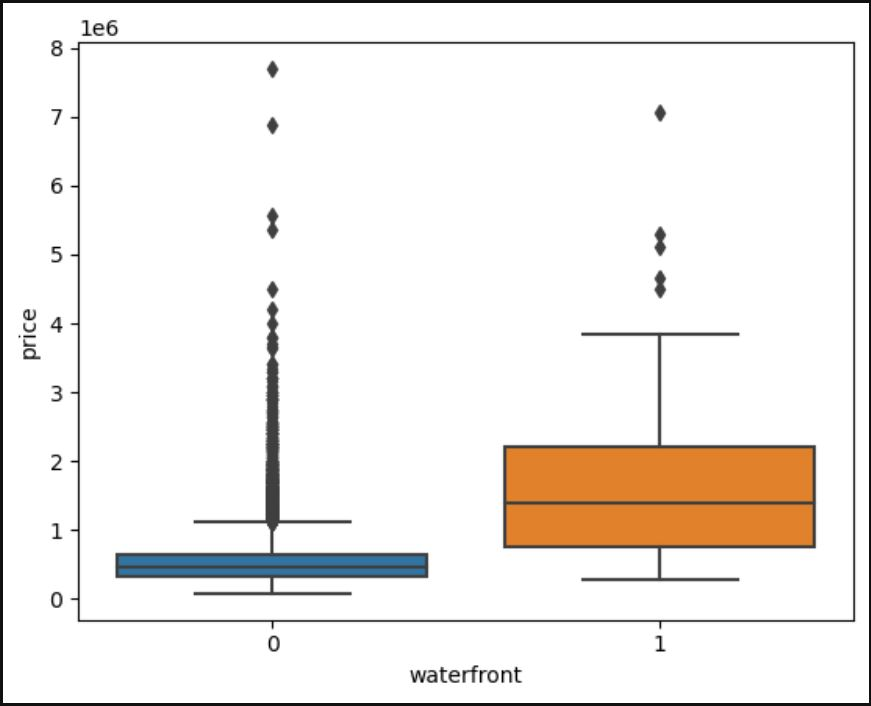
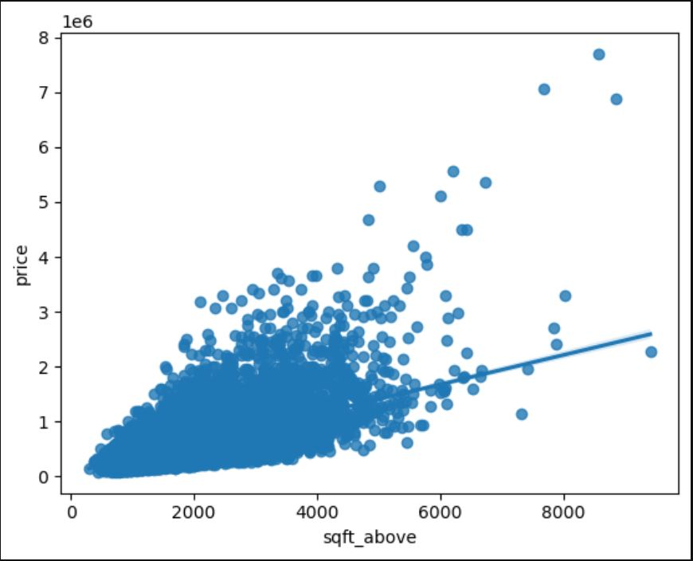

# Course #7: Data Analysis with Python

    

## Project: [House Sales Analysis in King County, USA](House_Sales_in_King_Count_USA.ipynb)
### Overview of Dataset
This dataset contains house sale prices for King County, which includes Seattle. It includes homes sold between May 2014 and May 2015.

Link to dataset: [House Sales Dataset](https://www.kaggle.com/datasets/harlfoxem/housesalesprediction?utm_id=NA-SkillsNetwork-wwwcourseraorg-SkillsNetworkCoursesIBMDeveloperSkillsNetworkDA0101ENSkillsNetwork20235326-2022-01-01)

| Variable      | Description                                                                                                 |
| ------------- | ----------------------------------------------------------------------------------------------------------- |
| id            | A notation for a house                                                                                      |
| date          | Date house was sold                                                                                         |
| price         | Price is prediction target                                                                                  |
| bedrooms      | Number of bedrooms                                                                                          |
| bathrooms     | Number of bathrooms                                                                                         |
| sqft_living   | Square footage of the home                                                                                  |
| sqft_lot      | Square footage of the lot                                                                                   |
| floors        | Total floors (levels) in house                                                                              |
| waterfront    | House which has a view to a waterfront                                                                      |
| view          | Has been viewed                                                                                             |
| condition     | How good the condition is overall                                                                           |
| grade         | overall grade given to the housing unit, based on King County grading system                                |
| sqft_above    | Square footage of house apart from basement                                                                 |
| sqft_basement | Square footage of the basement                                                                              |
| yr_built      | Built Year                                                                                                  |
| yr_renovated  | Year when house was renovated                                                                               |
| zipcode       | Zip code                                                                                                    |
| lat           | Latitude coordinate                                                                                         |
| long          | Longitude coordinate                                                                                        |
| sqft_living15 | Living room area in 2015(implies-- some renovations) This might or might not have affected the lotsize area |
| sqft_lot15    | LotSize area in 2015(implies-- some renovations)                                                            |

### Python libraries used:

### Exploratory Data Analysis

### Model Deployment, Evaluation, and Refinement 
- Linear Regression
    - Target variable: price
    - Predictor variable: sqft_living
    - Correlation: 0.702
    - $R^{2}$ = 0.4928
      
- Multiple Linear Regression
    - Target variable: price
    - Predictor variable: floors, waterfront, lat, bedrooms, sqft_basement, view, bathrooms,
           sqft_living15, sqft_above, grade, sqft_living
    - $R^{2}$ = 0.6577
      
- Ridge Regression
    - Regularization parameter $\alpha$ = 0.1
    - Target variable: price
    - Predictor variables (features): floors, waterfront, lat, bedrooms, sqft_basement, view, bathrooms, sqft_living15, sqft_above, grade, sqft_living
    - $R^{2}$ = 0.6479
      
- Multivariate Polynomial Regression (order = 2) with Ridge Regression
    - Regularization parameter $\alpha$ = 0.1
    - Target variable: price
    - Predictor variables (features): floors, waterfront, lat, bedrooms, sqft_basement, view, bathrooms, sqft_living15, sqft_above, grade, sqft_living
    - $R^{2}$ = 0.7003
    
### Conclusion and Key Takeaways
- Homes that do not have a view to a watefront has more outliers than the homes that do have a waterfront
- Homes with a waterfront view are priced higher than the homes with no waterfront
- House prices tend to increase as the square footage of homes increase (correlation = 0.702)
- The Model that best predicts the house prices ($R^{2}$ = 0.7003) uses both Multivariate Polynomial Regression (order = 2) along with Ridge Regression
