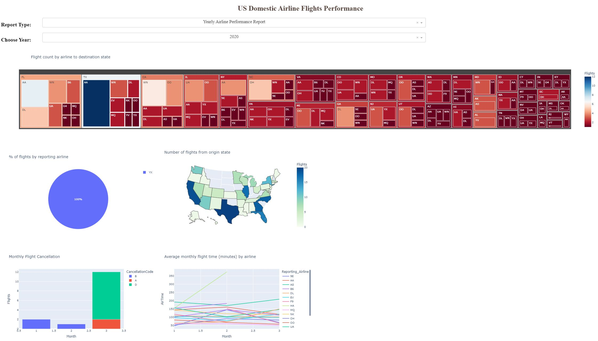
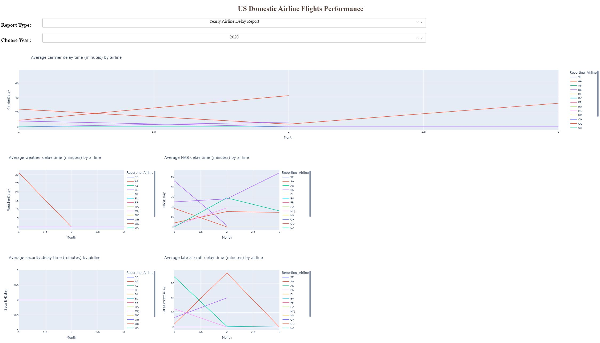

# Course #8: Data Visualization with Python

    

## Project: [U.S. Domestic Airline Flights Performance Dashboard (2005-2020)](US_domestic_airline_flights_performace.ipynb)
### Goal
- To analyze performance of the reporting airline to improve flight reliability thereby improving customer reliability
- Create two different reports in the dashboard
    - Yearly airline performance report
    - Yearly average flight delay statistics
    
#### Components of the Report Items
1.  Yearly airline performance report

    For the chosen year provide,

    *   Number of flights under different cancellation categories using bar chart.
    *   Average flight time by reporting airline using line chart.
    *   Percentage of diverted airport landings per reporting airline using pie chart.
    *   Number of flights flying from each state using choropleth map.
    *   Number of flights flying to each state from each reporting airline using treemap chart.   
2.  Yearly average flight delay statistics

    For the chosen year provide,

    *   Monthly average carrier delay by reporting airline for the given year.
    *   Monthly average weather delay by reporting airline for the given year.
    *   Monthly average natioanl air system delay by reporting airline for the given year.
    *   Monthly average security delay by reporting airline for the given year.
    *   Monthly average late aircraft delay by reporting airline for the given year.
    
### Tools/Data used
Python libraries: 
   
Tools: 
### Installation Notes
This project was completed using JupyterLab on the Anaconda Distribution. More libaries may need to be imported to complete this project on the local machine.

Here are a few links to install the following packages and libraries:
- [How to use dash within Jupyter notebook or JupyterLab](https://stackoverflow.com/questions/45490002/how-to-use-dash-within-jupyter-notebook-or-jupyterlab)
- [Jupyter-Dash Installation](https://github.com/plotly/jupyter-dash)
- [Jupyterlab-Dash Installation](https://pypi.org/project/jupyterlab-dash/)
- [Installing Python Plotly Dash](https://stackoverflow.com/questions/49613878/python-install-dash-with-conda)

### Dashboards
Below are the dashboards for each report type. The code to run the dashboard application can be found by accessing the [Python file](US_domestic_airline_flights_performance_dashboard.py) or on the [notebook file](US_domestic_airline_flights_performace.ipynb).

If running the Python file or notebook file on your own local machine, make sure to install the following packages or libraries as mentioned above in the "**Installation Notes**".
#### Yearly Airline Performance Report (2020)

#### Yearly Average Flight Delay Statistics (2020)
